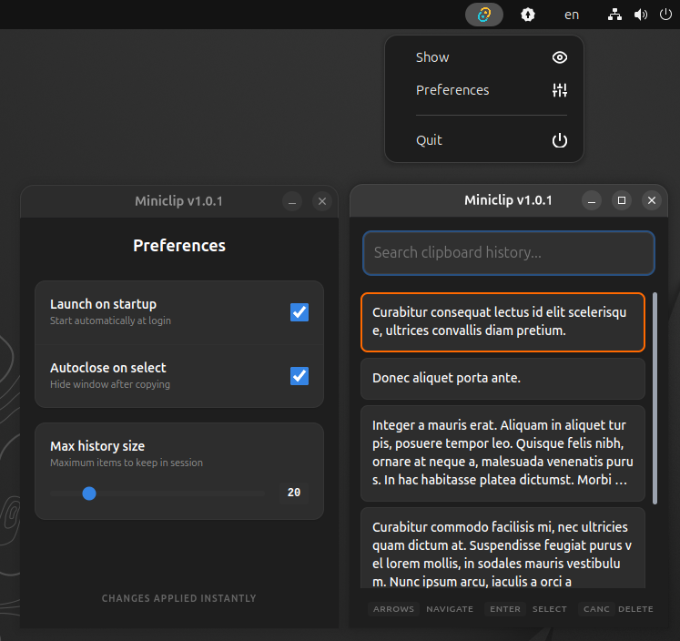

# Miniclip



A minimal, lightweight, modern clipboard manager for Linux (Wayland/X11), built with Electron and React.

## Features
- **Modern UI**: Clean, GNOME-inspired design with system theme support.
- **In-Memory History**: Stores text-only clipboard entries during your current session.
- **Start Hidden**: Launches hidden to the system tray to stay out of your way.
- **Fast Search**: Instantly filter through your history as you type.

## Usage

Miniclip monitors your clipboard and stores a history of text entries.
- **Arrows**: Move across items in the list.
- **Enter**: Copy an item back to the clipboard.
- **Delete**: Remove an item.
- **Filter**: Find a specific item.

By default, Miniclip starts hidden in the system tray. To show the window, click the tray icon or run:
```bash
miniclip show
```

## Global Shortcut (Wayland & X11)

Due to security limitations in modern display servers like **Wayland**, applications are often restricted from registering global keybindings while they don't have focus. 

This is why it is recommend setting up a system-level shortcut. This ensures the best performance and compatibility with your desktop environment.

### Setting up a shortcut in GNOME
1. Open **Settings** -> **Keyboard** -> **View and Customize Shortcuts**.
2. Go to **Custom Shortcuts** -> **Add Shortcut**.
3. **Name**: `Miniclip Show`
4. **Command**: `miniclip show`
5. **Shortcut**: Your preferred combo (e.g., `Super+V` or `Ctrl+Alt+G`).

## Installation

**AppMan**: If you use [appman](https://github.com/phisch/appman), you can install it directly from the github release using:
```bash
appman -e undefinederror/miniclip miniclip
```

**AppImageLauncher**: For desktop integration, refer to  [AppImageLauncher docs](https://github.com/TheAssassin/AppImageLauncher).

**Manual**: You can also download the AppImage from [releases](https://github.com/undefinederror/miniclip/releases) and run it directly. See the [official documentation](https://docs.appimage.org/introduction/quickstart.html#how-to-run-an-appimage) on how to handle AppImages manually.


