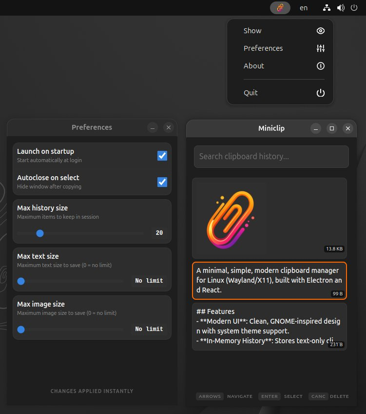

# Miniclip



A minimal, simple, modern clipboard manager for Linux (Wayland/X11), built with Electron and React.

Miniclip monitors your clipboard and stores a history of entries.
- **Arrows**: Move across items in the list.
- **Enter**: Copy an item back to the clipboard.
- **Delete**: Remove an item.
- **Filter**: Find a specific item.

## Installation

```
sudo snap install miniclip
```
Alternitavely grap the `.deb` or `.AppImage` from [releases](https://github.com/undefinederror/miniclip/releases/)

## Features
- **Modern UI**: Clean, GNOME-inspired design with system theme support.
- **In-Memory History**: Stores text-only clipboard entries during your current session.
- **Image support**: Stores both text and screenshots.


## Usage

Miniclip monitors your clipboard and stores a history of entries.
- **Arrows**: Move across items in the list.
- **Enter**: Copy an item back to the clipboard.
- **Delete**: Remove an item.
- **Filter**: Find a specific item.

When Miniclip is hidden in the system tray it can be shown by clicking the tray icon or runing:
```bash
miniclip show
```

## Global Shortcut (Wayland & X11)

Due to security limitations in modern display servers like **Wayland**, applications are often restricted from registering global keybindings while they don't have focus. 

This is why it is recommend setting up a system-level shortcut. This ensures the best performance and compatibility with your desktop environment.

### Setting up a shortcut in GNOME
1. Open **Settings** -> **Keyboard** -> **View and Customize Shortcuts**.
2. Go to **Custom Shortcuts** -> **Add Shortcut**.
3. **Name**: `Miniclip Show`
4. **Command**: `miniclip show`
5. **Shortcut**: Your preferred combo (e.g., `Super+V` or `Ctrl+Alt+G`).


